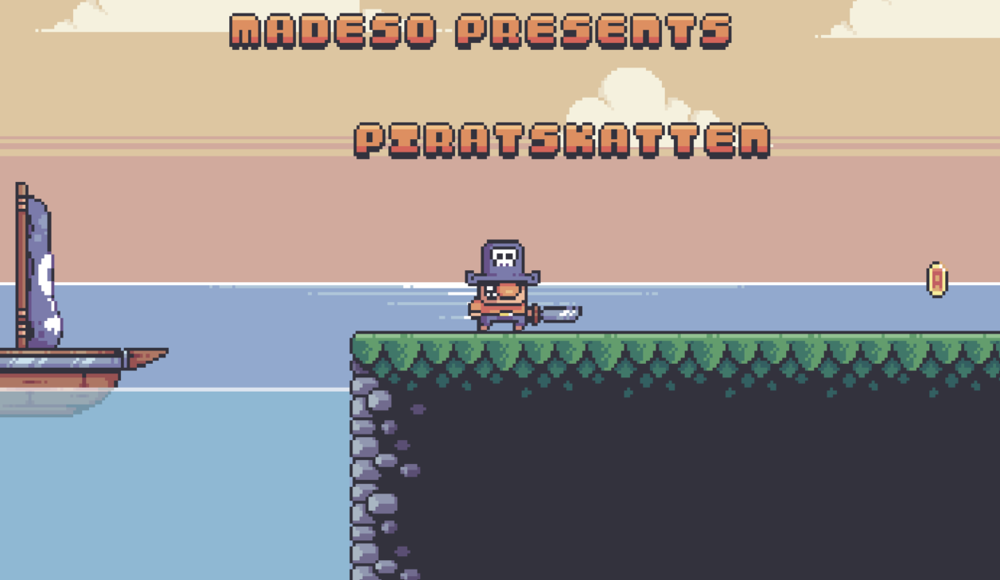

# Spelsylt 8 - Piratskatten

As a pirate, find treasures in a hostile world.

## Daily log

| Day | What | Time 
| - | - | -
| 11 | - | 0h
| 12 | - | 0h
| 13 | - | 0h
| 14 | basic controls + assetpack | 3h
| 15 | fixed auto tiling, larger demo level, ground/air acceleration/deacceleration, jump buffer, variable jump height, wall jump | 2h
| 16 | - | 0h
| 17 | - | 0h
| 18 | - | 0h
| 19 | - | 0h
| 20 | - | 0h
| 21 | added sprikes, gold pickup, and walking crab enemy that kills you | 3h
| 22 | added chest, treasure and pickup effects | 1.5h
| 23 | - | 0h
| 24 | Added sounds and added 3 basic levels | 2h
| 25 | Added chests to all levels, added a completion screen, added title and background parallax | 4h